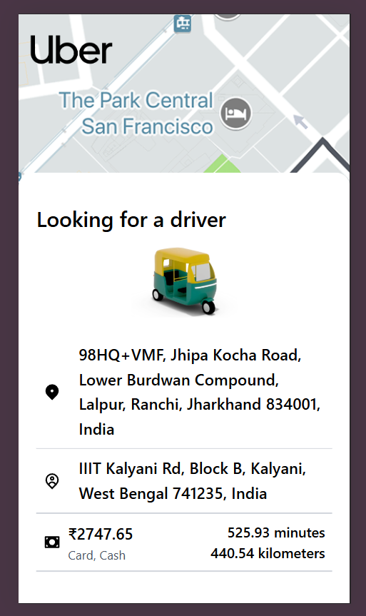
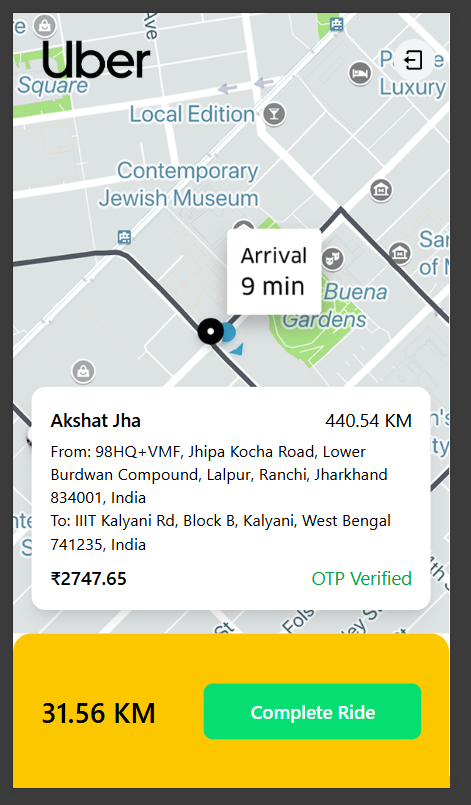
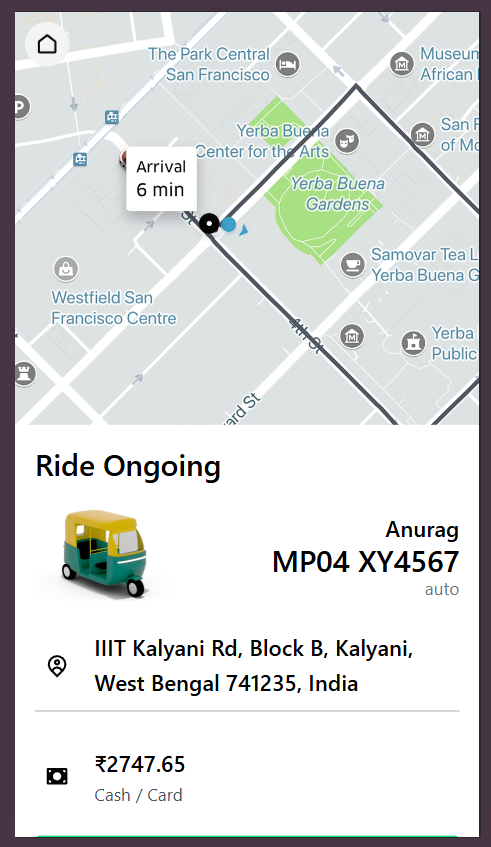
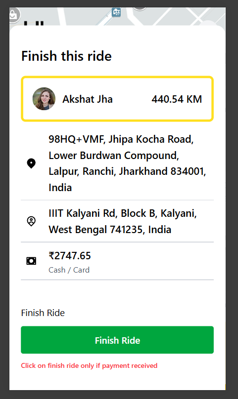

# 🚖 Real-Time Ride Booking System 

A **full-stack, real-time ride booking platform** inspired by Uber, built with **secure authentication**, **Socket.IO–based real-time communication**, **MongoDB geospatial queries**, and **OTP-based ride verification**.

This project demonstrates **production-grade system design**, not just CRUD APIs.

---

## 📌 Key Highlights

- 🔐 Heavy authentication & authorization (JWT + roles)
- 🔄 Real-time ride lifecycle using Socket.IO
- 🌍 Geospatial captain discovery (MongoDB)
- 🔑 OTP-based secure ride start
- 👥 Separate User and Captain (Driver) flows
- 📱 Realistic UI showing all ride states
- 🚀 Live tracking feature planned next

---

## 🧠 Project Overview

The system simulates a real-world cab booking platform where:

- Users can request rides
- Nearby captains receive ride requests in real time
- Captains accept/reject rides
- Ride starts only after OTP verification
- Ride state updates are synced instantly between user & captain

---

## 📸 Screenshots (Complete Ride Flow)

### 👤 User Flow

#### Confirm Ride

#### Looking for a Driver

#### Waiting for Driver

---

### 🧑‍✈️ Captain Flow

#### New Ride Available

#### OTP Verification

---

### 🚗 Ride Lifecycle

#### Ride Ongoing

#### Ride Ongoing (User View)

#### Finish Ride

---

### 💰 Dynamic Features

#### Dynamic Fare Calculation

#### Dynamic Location Search

---

## 🔐 Authentication & Authorization

### Security Features Implemented

- JWT-based authentication
- Role-based authorization (User / Captain)
- Protected routes using middleware
- Token validation on:
  - Ride creation
  - Ride acceptance
  - Ride start
  - Ride completion

This prevents unauthorized access, ride spoofing, and state manipulation.

---

## 🔄 Real-Time Communication (Socket.IO)

Socket.IO acts as the **real-time backbone** of the system.

### Socket Events

| Event | Description |
|------|------------|
| `join` | User/Captain joins socket room |
| `ride-created` | Notifies nearby captains |
| `ride-accepted` | Locks ride to one captain |
| `ride-started` | Ride begins after OTP verification |
| `ride-completed` | Syncs ride completion |

### Architecture Pattern
- Pub-Sub using socket rooms:
  - `user:<userId>`
  - `captain:<captainId>`

---

## 🌍 Geospatial Queries (MongoDB)

- MongoDB geospatial indexing
- Captains stored with live coordinates
- Nearby captains fetched using location-based queries

This ensures scalability and realistic ride allocation.

---

## 🔑 OTP-Based Ride Start

- OTP generated server-side
- Ride cannot start without OTP verification
- OTP validated before transitioning ride to ONGOING

This adds a production-level security layer.

---

## 🚦 Ride State Flow
IDLE
→ RIDE_REQUESTED
→ DRIVER_ASSIGNED
→ OTP_VERIFIED
→ RIDE_ONGOING
→ RIDE_COMPLETED

Each transition is validated on the backend and synced in real time.

---

## 👤 User Features

- Create ride
- View fare and distance
- Receive live updates:
  - Driver assigned
  - Ride started
  - Ride completed
- OTP-based safety verification

---

## 🧑‍✈️ Captain Features

- Receive nearby ride requests
- Accept / Reject rides
- View pickup, drop, distance, and fare
- Start ride only after OTP
- Complete ride securely

---

## 🛠️ Tech Stack

### Frontend
- React
- Context API
- Tailwind CSS

### Backend
- Node.js
- Express.js
- MongoDB
- Mongoose

### Real-Time
- Socket.IO

### Security
- JWT
- Middleware-based route protection
- OTP verification

---
