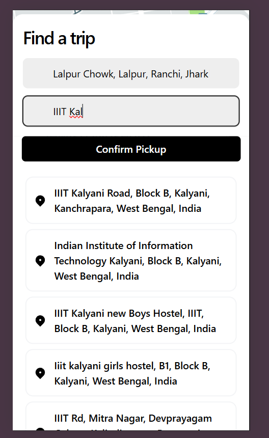
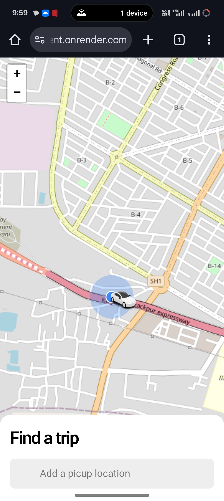
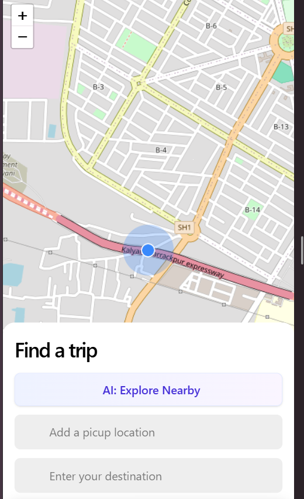
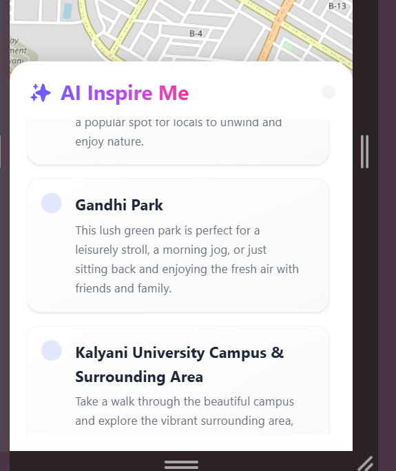
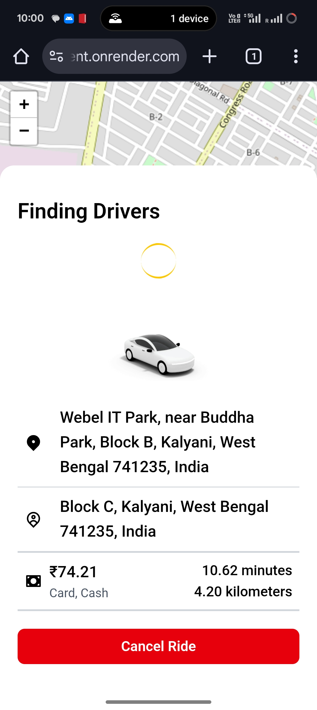
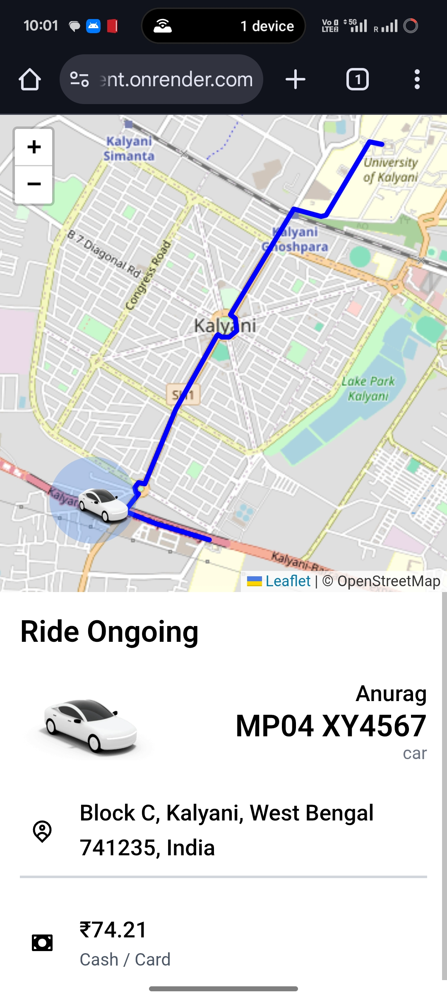
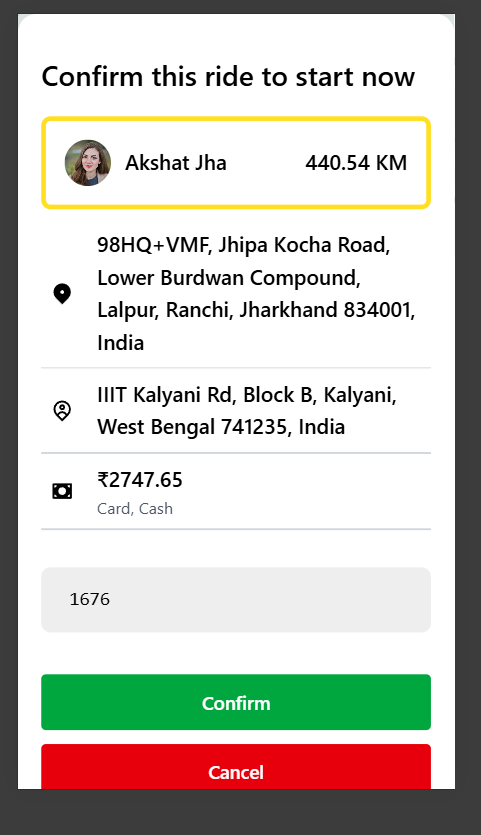
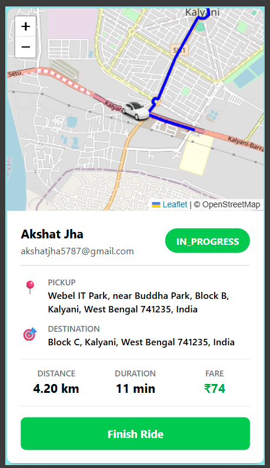
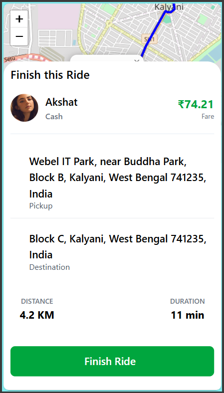

# RideShare Application Features Demo

Welcome to the visual walkthrough of the RideShare application. This folder contains screenshots demonstrating the comprehensive flow for both Users (Riders) and Captains (Drivers), highlighting key features from booking to interaction and payment.

## 📱 User (Rider) Flow

### 1. Discovery & Booking
Experience a seamless booking process with intuitive maps and search.

*   **Dynamic Search Location**: Smart address autocomplete and location selection.
    
    

*   **Nearby Drivers**: See available drivers in your vicinity in real-time.
    
    

### 2. AI-Powered Recommendations
Discover exciting places around your location with intelligent suggestions.

*   **AI Explore Nearby**: Get tailored recommendations for places to visit.
    
    

*   **Nearby Location Recommendations**: Explore nearby attractions based on your location.
    
    

### 3. Connecting with a Driver
State-of-the-art matching system interactions.

*   **Looking for Driver**: The system broadcasts your request to nearby captains.
    
    

### 4. On The Move
Real-time updates during your journey.

*   **Ride Ongoing**: Live tracking of your trip progress.
    
    

---

## 🚗 Captain (Driver) Flow

### 1. Trip Execution
Secure and guided trip management.

*   **OTP Verification**: Secure start-code system to ensure the right passenger is picked up.
    
    

*   **Ride Ongoing**: Driver-side navigation and trip status.
    
    

### 2. Completion & Earnings
Tools to manage business and performance.

*   **Finish Ride**: Simple workflow to complete the trip and process payment.
    
    

*   **Driver Earnings**: Comprehensive dashboard for tracking revenue.
    
    
